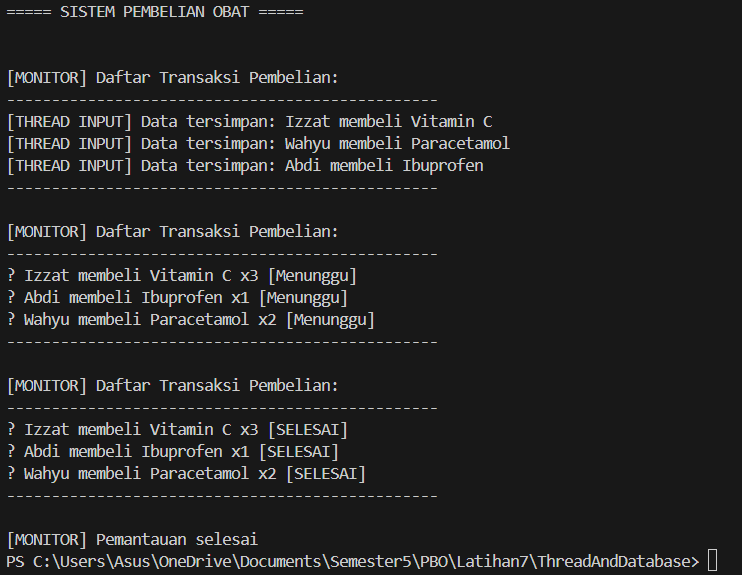

# Sistem Pembelian Obat — Thread + Database (Java)
**Nama:** Yusri Abdi
**NIM:** F1D02310098

Program ini merupakan contoh sederhana pemakaian **Thread**, **Database (MySQL)**, dan konsep **OOP (encapsulation, inheritance, polymorphism, abstraction)** pada aplikasi pembelian obat di apotek.

---
## Fitur Utama
- Menambahkan transaksi pembelian obat
- Menyimpan transaksi ke database secara asynchronous menggunakan `Thread`
- Menampilkan status transaksi secara periodik dengan `Thread`
- Konsep OOP:
  - Encapsulation
  - Inheritance
  - Polymorphism
  - Abstraction
- Koneksi ke database MySQL
---
## Database
```
CREATE DATABASE apotek_db;
USE apotek_db;

CREATE TABLE pembelian (
    id INT AUTO_INCREMENT PRIMARY KEY,
    pembeli VARCHAR(60),
    obat VARCHAR(60),
    jumlah INT,
    status VARCHAR(20)
);
```
---
## Konfigurasi Database
Edit file `DBHandler.java`:
```java
private static final String URL = "jdbc:mysql://localhost:3306/db_apotek";
private static final String USER = "root";      // ganti bila perlu
private static final String PASS = "";          // ganti bila perlu
```
---
### Penjelasan File
1. PesanObatTask.java
    `PesanObatTask` adalah thread yang menyimpan data pembelian obat ke tabel pembelian di database. Saat dijalankan, thread membuat koneksi, menjalankan perintah INSERT menggunakan `PreparedStatement`, menampilkan pesan berhasil, lalu melakukan jeda singkat. Jika koneksi gagal atau terjadi error, pesan kesalahan ditampilkan.
2. MonitorPembelianTask.java
    `MonitorPembelianTask` merupakan thread yang berfungsi menampilkan data pembelian dari tabel pembelian secara berkala. Saat dijalankan, thread membuka koneksi menggunakan `DBConnector`, lalu menjalankan query `SELECT` untuk membaca seluruh transaksi dan mencetaknya ke konsol sebanyak tiga kali. Pada iterasi terakhir, status pesanan otomatis ditampilkan sebagai `“SELESAI”`. Thread memberi jeda singkat di setiap siklus pemantauan, dan menutup pemantauan setelah selesai.
3. DBConector.java
    `DBConnector` merupakan class utilitas yang digunakan untuk mengelola koneksi ke database MySQL. Class ini menyimpan konfigurasi berupa `URL database`, `username`, dan `password`. Melalui method statis `connect()`, program memuat driver `com.mysql.cj.jdbc.Driver` lalu mencoba membuat koneksi menggunakan `DriverManager`. Jika berhasil, method mengembalikan objek `Connection`, dan jika gagal akan menampilkan pesan kesalahan serta mengembalikan `null`.
4. App.java
    `App` merupakan class utama yang menjalankan seluruh proses aplikasi. Pada method `main()`, program membuat beberapa thread `PesanObatTask` untuk menambahkan data pembelian obat ke database, dan satu thread `MonitorPembelianTask` untuk menampilkan transaksi secara berkala. Setelah objek thread dibuat, semua thread dijalankan secara bersamaan menggunakan `start()`, sehingga proses input dan monitoring dapat terjadi secara `paralel`.
---
## Contoh Output
1. Output Terminal
   
2. Database
   
---
## Kesimpulan
Program ini menunjukkan bagaimana konsep multithreading dan database dapat diterapkan pada aplikasi Java untuk mensimulasikan sistem pembelian obat di apotek. Thread PesanObatTask berjalan secara paralel untuk menyimpan data transaksi ke database, sementara MonitorPembelianTask memantau dan menampilkan data pembelian secara berkala. Melalui koneksi JDBC, data pembelian tersimpan secara permanen di MySQL. Hasil eksekusi memperlihatkan bahwa beberapa proses dapat berjalan bersamaan tanpa saling menunggu, sehingga sistem lebih efisien, responsif, dan mencerminkan perilaku aplikasi nyata yang menangani banyak transaksi secara simultan.
